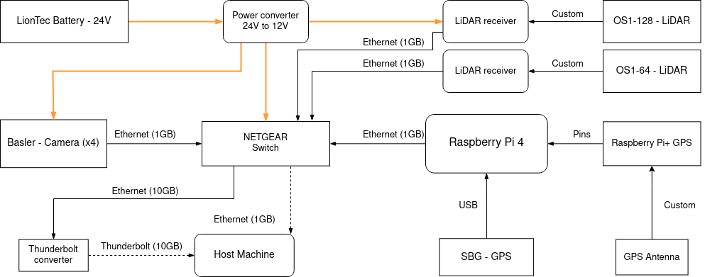
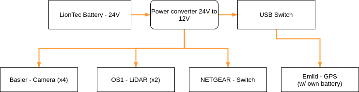

<!-- START doctoc generated TOC please keep comment here to allow auto update -->
<!-- DON'T EDIT THIS SECTION, INSTEAD RE-RUN doctoc TO UPDATE -->

- [Architecture](#architecture)
  - [Hardware Connections](#hardware-connections)
  - [Software Connections](#software-connections)
  - [PTP Connections](#ptp-connections)
  - [Power Connections](#power-connections)
  - [Diagram creation tool](#diagram-creation-tool)

<!-- END doctoc generated TOC please keep comment here to allow auto update -->

# Architecture

## Hardware Connections

 

  
 

## Software Connections

 

## PTP Connections

 

## Power Connections

## Diagram creation tool

If you need to change the architecture representation, you have to modify the following files. Once you are done with the modifications, export the png diagrams and place them into the `uploads` folder with the correct name.

- [ipb-arch-phyical.drawio](uploads/drawio/ipb-arch-physical.drawio)
- [ipb-arch-software.drawio](uploads/drawio/ipb-arch-software.drawio)
- [ipb-arch-power.drawio](uploads/drawio/ipb-arch-power.drawio)
- [ipb-arch-ptp.drawio](uploads/drawio/ipb-arch-ptp.drawio)

The diagrams were created with the VSC plugin called [Draw.Io Integration](https://marketplace.visualstudio.com/items?itemName=hediet.vscode-drawio), it is also available an online version tool called [diagram.net](https://app.diagrams.net/).
