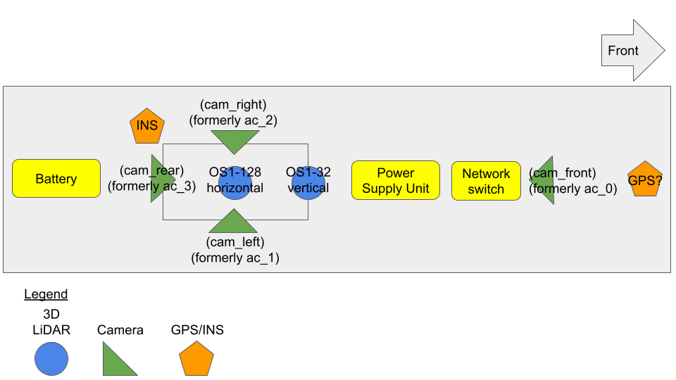

<!-- START doctoc generated TOC please keep comment here to allow auto update -->
<!-- DON'T EDIT THIS SECTION, INSTEAD RE-RUN doctoc TO UPDATE -->

- [Figure of sensor positions](#figure-of-sensor-positions)
- [LiDARs](#lidars)
  - [Ouster OS1-32](#ouster-os1-32)
  - [Ouster OS1-128](#ouster-os1-128)
- [Raspberry Pi+ GPS](#raspberry-pi-gps)
- [Cameras](#cameras)
  - [Basler Ace](#basler-ace)
    - [Cam 0](#cam-0)
    - [Cam 1](#cam-1)
    - [Cam 2](#cam-2)
    - [Cam 3](#cam-3)
- [SBG Dual Antenna RTK GNSS](#sbg-dual-antenna-rtk-gnss)
  - [SBG Ellipse-D](#sbg-ellipse-d)
  - [Sapos Box](#sapos-box)
- [Deprecated Sensors](#deprecated-sensors)
  - [Ouster OS1-64](#ouster-os1-64)
  - [Emlid Reach RS2](#emlid-reach-rs2)
  - [Flir Blackfly GigE](#flir-blackfly-gige)

<!-- END doctoc generated TOC please keep comment here to allow auto update -->

## Figure of sensor positions

Download the SVG [here](uploads/f295f6d5004f7a3dc9686d33c7a41494/IPB_car_sensor_setup.svg)

## LiDARs

### Ouster OS1-32

| Info             | Description                                           |
| ---------------- | ----------------------------------------------------- |
| Model            | OS1-32                                                |
| ROS ID           | os_v                                                  |
| IP Address       | 192.168.1.12                                          |
| MAC Address      | BC:0F:A7:00:40:B8                                     |
| Official Website | [here](https://ouster.com/products/os1-lidar-sensor/) |

### Ouster OS1-128

| Info             | Description                                           |
| ---------------- | ----------------------------------------------------- |
| Model            | OS1-128                                               |
| ROS ID           | os_h                                                  |
| IP Address       | 192.168.1.13                                          |
| MAC Address      | BC:0F:A7:00:19:2C                                     |
| Official Website | [here](https://ouster.com/products/os1-lidar-sensor/) |

## Raspberry Pi+ GPS

| Info    | Description                                                                               |
| ------- | ----------------------------------------------------------------------------------------- |
| Model   | HAB-GPSPI-NAN                                                                             |
| Website | [here](https://store.uputronics.com/index.php?route=product/product&product_id=81)        |
| Bought  | [here](https://www.rasppishop.de/GPS-HAT-kompatibles-Modul-Erweiterung-fuer-Raspberry-Pi) |
| Module  | [here](https://www.u-blox.com/sites/default/files/MAX-8_DataSheet_%28UBX-16000093%29.pdf) |

The Raspberry Pi+ GPS is used for synchronizing the clock time of the Raspberry Pi.

## Cameras

### Basler Ace

General information:

| Info             | Description                                                                               |
| ---------------- | ----------------------------------------------------------------------------------------- |
| Model            | acA2040-35gc                                                                              |
| IP Address       | (to set)                                                                                  |
| Frame Rate       | 36                                                                                        |
| Resolution       | 2048 x 1536                                                                               |
| Pixel Size       | 3.45                                                                                      |
| Sensor Name      | Sony IMX265                                                                               |
| Official Website | [here](https://www.baslerweb.com/en/products/cameras/area-scan-cameras/ace/aca2040-35gc/) |
| Documentation    | [here](https://docs.baslerweb.com/aca2040-35gc)                                           |

#### Cam 0

| Info              | Description       |
| ----------------- | ----------------- |
| Device User ID:   | ac_0              |
| ROS ID            | cam_front         |
| IP Address        | 192.168.1.20      |
| MAC Address       | 00:30:53:2F:C7:D7 |
| Viewing direction | front             |

#### Cam 1

| Info              | Description       |
| ----------------- | ----------------- |
| Device User ID:   | ac_1              |
| ROS ID            | cam_left          |
| IP Address        | 192.168.1.21      |
| MAC Address       | 00:30:53:31:71:B9 |
| Viewing direction | left              |

#### Cam 2

| Info              | Description       |
| ----------------- | ----------------- |
| Device User ID:   | ac_2              |
| ROS ID            | cam_right         |
| IP Address        | 192.168.1.22      |
| MAC Address       | 00:30:53:2F:C7:D7 |
| Viewing direction | right             |

#### Cam 3

| Info              | Description       |
| ----------------- | ----------------- |
| Device User ID:   | ac_3              |
| ROS ID            | cam_rear          |
| IP Address        | 192.168.1.23      |
| MAC Address       | 00:30:53:2F:C7:E0 |
| Viewing direction | back              |

## SBG Dual Antenna RTK GNSS

### SBG Ellipse-D

| Info             | Description                                                                         |
| ---------------- | ----------------------------------------------------------------------------------- |
| Model            | Ellipse-D                                                                           |
| Official Website | [here](https://www.sbg-systems.com/products/ellipse-series/#ellipse-d_rtk_gnss_ins) |
| Document         | [here](https://www.sbg-systems.com/wp-content/uploads/Ellipse_Series_Leaflet.pdf)   |

### Sapos Box

| Info     | Description                                                                            |
| -------- | -------------------------------------------------------------------------------------- |
| Document | [here](uploads/8f8a5888ca25bde3f592fe04f4f8397c/SaposBox_Technische_Dokumentation.pdf) |

## Deprecated Sensors

Old sensors that was part of the architecture, but now anymore.

### Ouster OS1-64

| Info             | Description                                           |
| ---------------- | ----------------------------------------------------- |
| Model            | OS1-64                                                |
| ROS ID           | os_v                                                  |
| IP Address       | 192.168.1.12                                          |
| MAC Address      | BC:0F:A7:00:09:0C                                     |
| Official Website | [here](https://ouster.com/products/os1-lidar-sensor/) |

### Emlid Reach RS2

| Info              | Description                         |
| ----------------- | ----------------------------------- |
| Model             | Reach RS2                           |
| IP Address (USB)  | 192.168.2.15                        |
| IP Address (WIFI) | 192.168.42.1                        |
| Official Website  | [here](https://emlid.com/reachrs2/) |

Emlid Reach RS2 is used for recording measurements.

### Flir Blackfly GigE

The Flir Blackfly GigE camera was dismissed because not capable of interfacing with the PTP protocol.

| Info             | Description                                                                |
| ---------------- | -------------------------------------------------------------------------- |
| Model            | BFS-PGE-31S4C-C                                                            |
| IP Address       | 192.168.1.15                                                               |
| Frame Rate       | 35                                                                         |
| Resolution       | 2048 × 1536                                                                |
| Pixel Size       | 3.45                                                                       |
| Sensor Name      | Sony IMX265                                                                |
| Official Website | [here](https://www.flir.com/products/blackfly-gige?model=BFLY-PGE-50S5C-C) |
