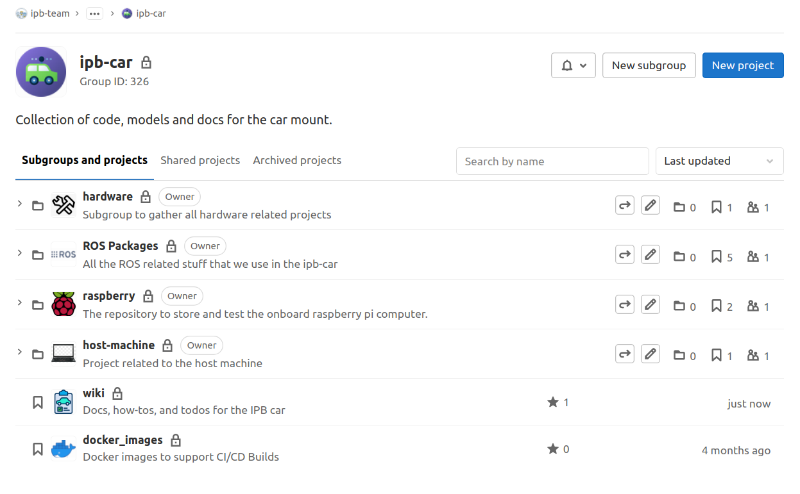

**ALL** the related code, wiki, configuration to the ipb-car project can and **must** be found at [the project root page](https://gitlab.ipb.uni-bonn.de/ipb-team/robots/ipb-car)

There you will find all the sub-projects that gather common functionality:

As an example, inside the [ROS Packages](https://gitlab.ipb.uni-bonn.de/ipb-team/robots/ipb-car/ros-packages) project you will find all the ROS projects and nodes we use to launch, record, and develop.

Each project on its own has their own description, so no need to duplicate it here
