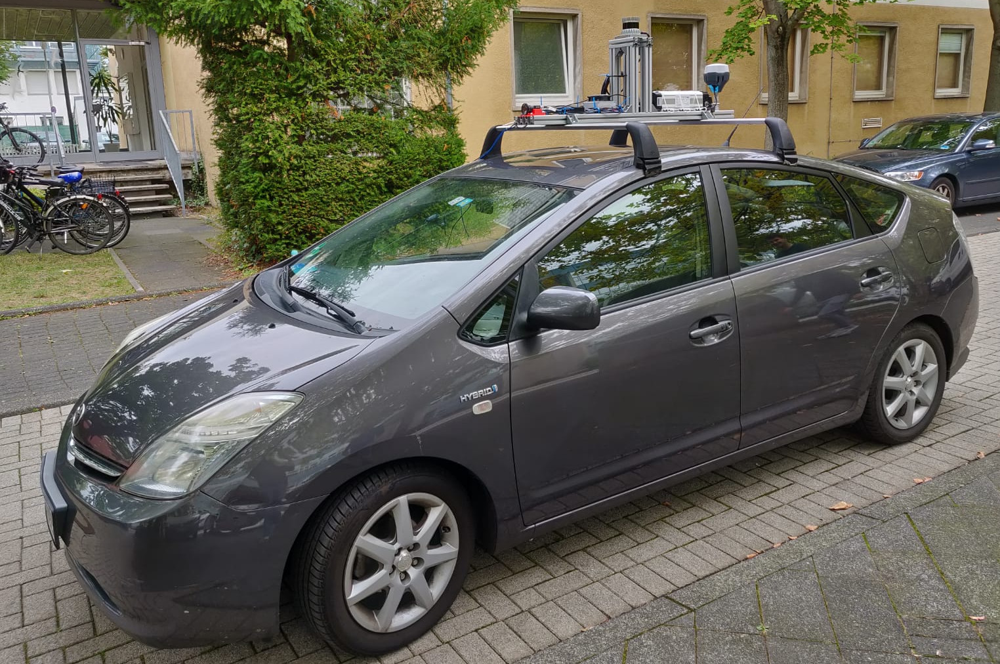
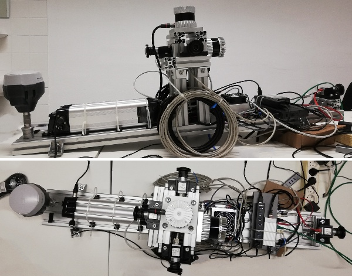

<!-- DOCTOC SKIP -->

# The IPB Car

## Overview

The IPB Car is a system composed of different sensors (lidar, cameras, GPS,
imu) and different devices capable of recording data. Besides the creation of
the physical structure, the system is principally able to maintain a fast and
reliable communication between every single sensor inside the network which
allows a robust recording of the measurements. This was possible thanks to the
implementation of the PTP (Precise Time Protocol) which allows the
synchronization of the clock of each device with the grandmaster clock in
order to provide accurate timestamps.

## Philosophy

This project is a team effort and is not a final product. This means that we are all open to improvements, suggestions, fixes, etc. If you see something that you feel is wrong or something that is missing you should not hesitate on changing or filling a new issue.

This project is not yet done! There are still many [tasks](https://gitlab.ipb.uni-bonn.de/groups/ipb-team/robots/ipb-car/-/issues) to be solved and [sub-projects](Project-Propossals) to be addressed. You are more than welcome to collaborate!

## Issues

The [Gitlab issue system](https://gitlab.ipb.uni-bonn.de/groups/ipb-team/robots/ipb-car/-/issues) is the one we have chosen to track all the current progress, new tasks, and ongoing bugs of the ipb-car. Be aware that each project on its own has an issue tracker. This is the most flexible and scalable way of keeping track of tasks and issues on such a big project.

If you feel lost and don't know where to fill the issue, add it wherever you want, our "scrum master" regularly checks for all new issues and will find a proper spot on your behalf.
