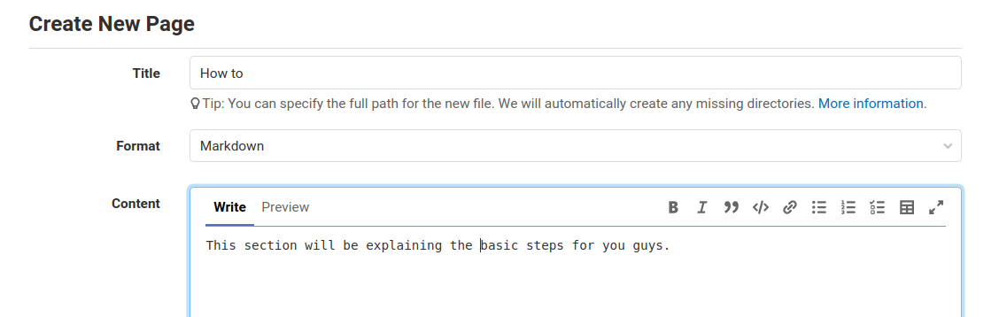
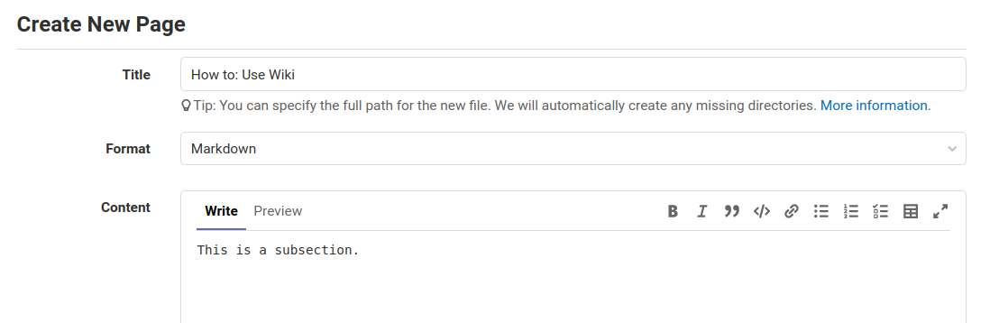

<!-- START doctoc generated TOC please keep comment here to allow auto update -->
<!-- DON'T EDIT THIS SECTION, INSTEAD RE-RUN doctoc TO UPDATE -->

- [Create a new page](#create-a-new-page)
- [Sidebar](#sidebar)
  - [Understand the pipeline](#understand-the-pipeline)
  - [Using the Sidebar](#using-the-sidebar)
- [Extra steps](#extra-steps)

<!-- END doctoc generated TOC please keep comment here to allow auto update -->

## Create a new page

In order to create a new page, we click the button **New page**.


Then we set a **Title**. It is an important step because this will influence
the look of our cool sidebar.

If you want to create a main page that gives an overview of the section, you
just type a name and you fulfill the content (keep in mind that you can't
create a blank page).


If you want to create a subpage of the section it is **important** to use a
colon after the section name. So for example, the subpage of the section
**How to** is **Use wiki**. In order to create it, the title is



## Sidebar

### Understand the pipeline

So currently the magic sidebar comes from the
[github-wiki-sidebar](https://github.com/adriantanasa/github-wiki-sidebar),
in general, in our CI/CD system, it is processed via commend

`github-wiki-sidebar --silent --git-push`

so you don't have to do anything to generate a page in the sidebar (sometimes
you need to refresh or wait for the completion of ci/cd).

To customize sidebar edit **options.json** file.

### Using the Sidebar

If you want to see this structure on the sidebar:

```sh
└── page
  └── subpage1
      └── subpage2
```

Then you should create a file called **`page:subpage1:subpage2.md`** and so on.

## Extra steps

We now also automatically:

- Generate a table of contents for each page

```yaml
# Update tables of content
- grep -L 'DOCTOC SKIP' *.md | xargs doctoc --notitle
```

- Format all `markdown` pages, after you modify it

```yaml
# Auto format all markdown pages
- prettier --write *.md
```
