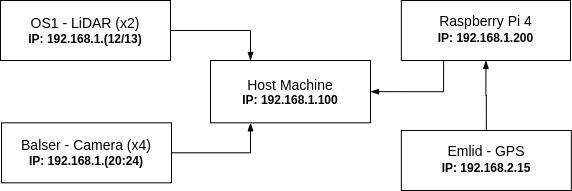
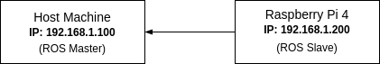
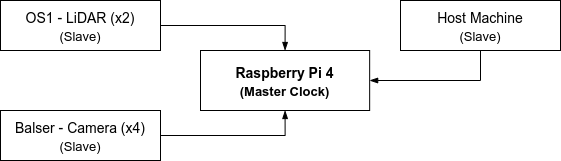

<!-- START doctoc generated TOC please keep comment here to allow auto update -->
<!-- DON'T EDIT THIS SECTION, INSTEAD RE-RUN doctoc TO UPDATE -->

- [Architecture](#architecture)
- [Host Machine](#host-machine)
- [Raspberry PI](#raspberry-pi)
- [ROS](#ros)
  - [ROS Master](#ros-master)
  - [`ros::Time::now()`.](#rostimenow)
  - [ROS Slave](#ros-slave)
- [Precise Time Protocol](#precise-time-protocol)
- [Frequent-calculations notebook](#frequent-calculations-notebook)

<!-- END doctoc generated TOC please keep comment here to allow auto update -->

The system network is capable of sustaining robust communication between the sensors and the Host Machine. On this page, you can have a general understanding of how this was made possible and which services were used.

## Architecture

The network architecture is displayed in the figure below and shows the communications flow based on the direction of the arrows.

LiDARs and Cameras are directly connected to the network while the Emlid GPS is connected via USB to the RPI. This because the Emlid does not have an ethernet interface, but only a USB port. The Host Machine has a central role in the communications and is responsible for receiving all the measurements and finally record them.

If you want to understand the physical connection of each component with the whole system, then take a look at the [Hardware Connections](Architecture#hardware-connections) section.

## Host Machine

The Host Machine is the laptop connected to the network which the operator uses to launch the software capable of recording the measurement from the sensors. We have created different launch files that simplify the launching procedure of the system (take a look at the [Launch the system](Setup%3ALaunch-the-sys) and we are currently working on a more simplified version. Once all the software is running, the measurements are published as a [ROS topic](http://wiki.ros.org/Topics) and then recorded by the [Rosbag](http://wiki.ros.org/rosbag) service.

## Raspberry PI

The Raspberry PI has the fundamental role of running the PTP protocol inside the network and to act as a Master Clock (a detailed explanation can be found in the [Precise Time Protocol](#precise-time-protocol) section of this page). Furthermore, it is also able to fetch GPS measurements and publish them in the network.

## ROS

ROS (Robotic Operating System) is a robotics middleware that provides a series of services oriented to improve the creation of more complex robotics systems. In our case, its use is fundamental for the communication and recording of measurements. Furthermore, it helps to create a communication channel between the Host Machine and the Raspberry PI, which only the latter is in charge of communicating with the Emlid GPS via USB.

The Host Machine is the [ROS Master](http://wiki.ros.org/Master) and the Raspberry PI the ROS Slave. In ROS, master and slaves are interacting with each other in a specific way, let's then understand it more in detail with respect to our architecture.

### ROS Master

The **Host Machine** has the ROS Master role because of its simplicity to access, the centralization of all running software inside a unique system, and the better performance compared with the Raspberry Pi. In fact, as it is possible to read by the following statement, its only job is to monitor the ROS system network and to manage the communications.

> The ROS Master provides naming and registration services to the rest of the nodes in the ROS system. It tracks publishers and subscribers to topics as well as services. The role of the Master is to enable individual ROS nodes to locate one another. Once these nodes have located each other they communicate with each other peer-to-peer.
>
> <cite>[ROS Master - docs][1]</cite>

### `ros::Time::now()`.

**ALL** the nodes that are not connected to the `PTP` network(thus, using a `msg.header.stamp = ros::Time::now();`) **AND** the `tf` transformation will use the system (**that is running the node, be this the RPI or the host-machine**) clock for stamping the messages.

### ROS Slave

The **Raspberry PI** has the ROS slave role and its task is to fetch GPS measurements and publish them in the network.

## Precise Time Protocol

The Precision Time Protocol (PTP) is used to synchronize clocks throughout a computer network. In our architecture, this protocol is fundamental for recording measurements with consistent timestamps from different sensors which are sharing the same clock time. Keeping everything synchronized is increasingly important to investigate measurements in the second place.

The main reason for the RPI being the `PTP` master is that it has a **GPS** equipped with the so-called `PPS` signal. This `PPS` signal is wired to the `GPIO`s pins in the RPI. From this signal + using `chrony` the RPI system-time will sync every `1` second with the absolute time coming from the GPS satellites, therefore, providing a drift-free absolute system time.

The Raspberry PI, as previously mentioned, is able to act as a master clock within the network and shares its clock time with other devices, which will synchronize their time accordingly. The master clock is fetching the time from the GPS every second and this concept is explained more in detail in the [GPS Clock Synchronization](Precise-Time-Protocol%3AGps-Clock-Synchronization) page.

[1]: http://wiki.ros.org/Master

## Frequent-calculations notebook

Given that we did some calculations over and over we've decided to put a [python notebook](./Network:Frequent-calculations.ipynb) in case you need to compute (as an example) the bandwidth consumed by 1 camera
