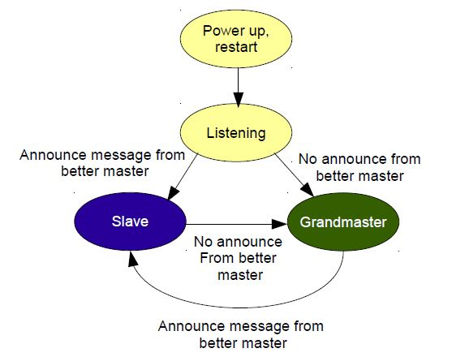

<!-- START doctoc generated TOC please keep comment here to allow auto update -->
<!-- DON'T EDIT THIS SECTION, INSTEAD RE-RUN doctoc TO UPDATE -->

- [PTP configuration](#ptp-configuration)
  - [Best master clock algorithm](#best-master-clock-algorithm)
    - [Priority 1](#priority-1)
    - [Clock Class](#clock-class)
    - [Clock Accuracy](#clock-accuracy)
    - [ptp4l.conf](#ptp4lconf)
    - [Announce interval](#announce-interval)
    - [Sync message interval](#sync-message-interval)
    - [ptp4l.conf](#ptp4lconf-1)
  - [PTP4L service](#ptp4l-service)
    - [Attention!](#attention)

<!-- END doctoc generated TOC please keep comment here to allow auto update -->

# PTP configuration

In the Raspberry Pi 4, PTP is enabled by default. Now we'll synchronize the gps as reference for the clock. This the Raspberry Pi should assume always the _granmaster role_ inside your network and ensure that all the connected devices assume the _slave role_.

Install ptp4l in the Raspberry Pi:

```
sudo apt install linuxptp
```

Enable the service to allow `ptp4l` to always run in the background:

```
sudo systemctl enable ptp4l
sudo systemctl start ptp4l
```

The `/etc/linuxptp/ptp4l.conf` is the default configuration file used from ptp4l where you can specify all the parameters that will regulate the communication. As mentioned above, the goal is to ensure that the rpi will be recognized as the master device and to do so it is necessary to understand how the _best master clock algorithm_ works.

## Best master clock algorithm

The best master clock (BMC) algorithm performs an hierarchical properties selection of the best candidate clock in the indicated order:

1. Priority 1 – the user can assign a specific static-designed priority to each clock, preemptively defining a priority among them. Smaller numeric values indicate higher priority.
2. Class – each clock is a member of a given class, each class getting its own priority.
3. Accuracy – precision between clock and UTC, in nanoseconds (ns)
4. Variance – variability of the clock
5. Priority 2 – final-defined priority, defining backup order in case the other criteria were not sufficient. Smaller numeric values indicate higher priority.
6. Unique identifier – MAC address-based selection is used as a tiebreaker when all other properties are equal.

### Priority 1

The Priority 1 is the first property checked from the BMC algorithm and needs to be rigorously set to a small value (since smaller numeric values indicate higher priority). In our configuration is set to 0.

### Clock Class

The Clock Class allow the assignment of a specific class to the clock of the device, in our configuration the class specified is the number 6. This value correspond to the following property: _Designates a clock that is synchronized to a primary reference time source. The time scale distributed is PTP A clock Class 6 clock shall not be a slave to another clock in the domain_. See the [this](https://silo.tips/download/ntp-network-time-protocol-and-ptp-precision-time-protocol-part-2-ptp) document and search for `Note 1` to learn more of other classes.

### Clock Accuracy

The Clock Accuracy is an enumerated list of ranges of accuracy to UTC. In our configuration this property is set to `0x31` which correspond to _Accurate to > 10s_. The reason of why this has ben changed from `0xFE` (unknown, the default one) is because the Balser cameras have configured the value to `0xFE` and this was creating conflicts while synchronizing them with the PTP protocol. See the [this](https://silo.tips/download/ntp-network-time-protocol-and-ptp-precision-time-protocol-part-2-ptp) document and search for `Note 2` to learn more of other classes.

### ptp4l.conf

The `/etc/linuxptp/ptp4l.conf` configuration relative to the clock selection:

```bash
[global]
#
# Default Data Set
#
twoStepFlag             1
slaveOnly               0
priority1               0
priority2               128
domainNumber            0
clockClass              6
clockAccuracy           0x31
offsetScaledLogVariance 0xFFFF
free_running            0
freq_est_interval       1
dscp_event              0
dscp_general            0

...
```

### Announce interval

After power up the first thing the clock does is “listen”, in other words it look for Announce messages from the PTP general multicast address. An Announce message contains the properties of the clock which sent it. If the Ordinary Clock sees an Announce message from a better clock it goes into a slave state, or passive if it is not slave capable. If the Ordinary Clock does not see an Announce message from a better clock within the Announce Time Out Interval, then it takes over the role of Grandmaster. This runs continuously so master capable devices are constantly on the look out for the possible loss of the current master clock. For this reason **it is critical that the Announce Time Out Interval be set longer than the Announce Interval in your network**. If you don’t then master capable devices will keep jumping to the conclusion that the master has gone away and they need to take over. Its like a bunch of political pundits on a talk show who never listen and keep talking over each other.



For this reason it is **fundamental** that all your devices in whole domain share the same Announce interval (expressed as log 2 i.e. -1=0.5s, 0=1s, 1=2s etc.). In our configuration the value is 1=2s.
Make sure that also the _Announce Receipt Timeout_ is the same of the other devices. This specify the number of missed Announce messages before the last Announce messages expires. In our configuration the value is 3=8s.

### Sync message interval

PTP sync message interval in master state (expressed as log 2 i.e. -1=0.5s, 0=1s, 1=2s etc.). In our configuration the value is -1=0.5s.

### ptp4l.conf

The `/etc/linuxptp/ptp4l.conf` configuration relative to the announce interval:

```bash
...

#
# Port Data Set
#
logAnnounceInterval         1
logSyncInterval             -1
logMinDelayReqInterval      0
logMinPdelayReqInterval     0
announceReceiptTimeout      3
syncReceiptTimeout          0
delayAsymmetry              0
fault_reset_interval        4
neighborPropDelayThresh     20000000

...
```

## PTP4L service

The default systemd service file attempts to use the eth0 address on the command line. Make sure that your interface is correctly configured.

Run `ifconfig` to read the name of your interface and check that inside the `/etc/systemd/system/multi-user.target.wants/ptp4l.service` file is properly specified.

```config
[Service]
Type=simple
ExecStart=/usr/sbin/ptp4l -f /etc/linuxptp/ptp4l.conf -m -i eth0
```

If not, change it and restart the systemctl daemon:

```bash
systemctl daemon-reload
```

### Attention!

The parameters of the ptp4l.conf file are always relative to the domain configuration and they were figured after analyzing the situation and many trials. Even for small details, the PTP algorithm can create weird behaviors. If other sensors / devices will be added in the future, I suggest to look carefully to their documentation and check their internal PTP parameters. Usually, those parameters cannot be changed and the only possible way is to adapt to them.

You may need to make some checks for the current network status relative to the PTP protocol. In the following page you can find a series of tools useful for figuring out what's happing.

Go to [PTP Monitoring](Precise-Time-Protocol%3APTP monitoring).
