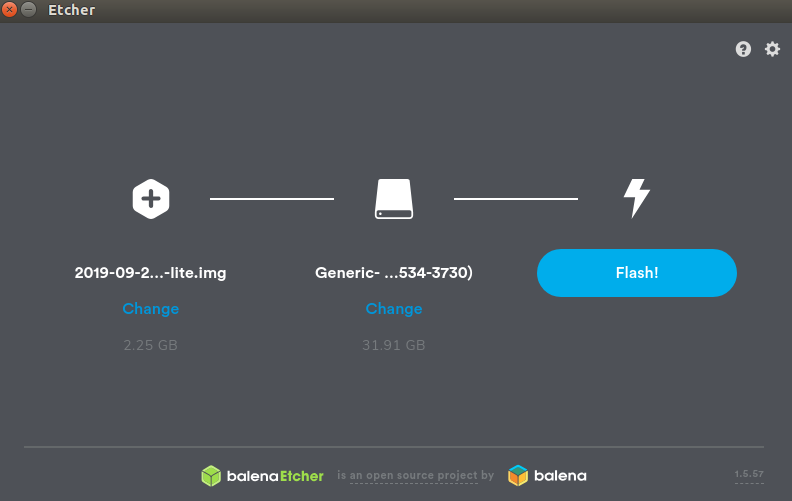

<!-- START doctoc generated TOC please keep comment here to allow auto update -->
<!-- DON'T EDIT THIS SECTION, INSTEAD RE-RUN doctoc TO UPDATE -->

- [Burn image into the SD](#burn-image-into-the-sd)
- [Boot the raspbian for the very first time](#boot-the-raspbian-for-the-very-first-time)
- [Troubleshooting](#troubleshooting)

<!-- END doctoc generated TOC please keep comment here to allow auto update -->

This is the Raspbian OS configuration for the Raspberry Pi of the ipb_car.

## Burn image into the SD

Download latest artifacts from [here](https://gitlab.ipb.uni-bonn.de/ipb-team/robots/ipb-car/raspberry/pi-gen/-/jobs/artifacts/master/browse?job=build)

Download etcher from [here](https://www.balena.io/etcher/)

Run etcher as sudo, and select the image `.zip` file and the SD card. You should see something like this:

## Boot the raspbian for the very first time

Insert the SD card on the raspberry pi, hook up an ethernet cable(_optional_), and power the
board. **You don't need an extra monitor, extra mouse, and stuff like this**

The default username and password are:

- username: pi
- password: ipb-car

## Troubleshooting

Please see [Troubleshooting:Raspberry-pi](Troubleshooting%3ARaspberry-pi)
